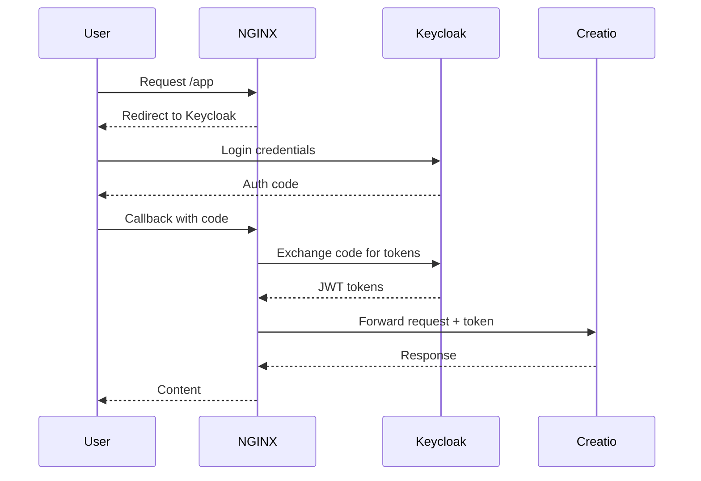
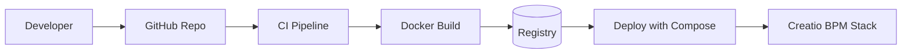
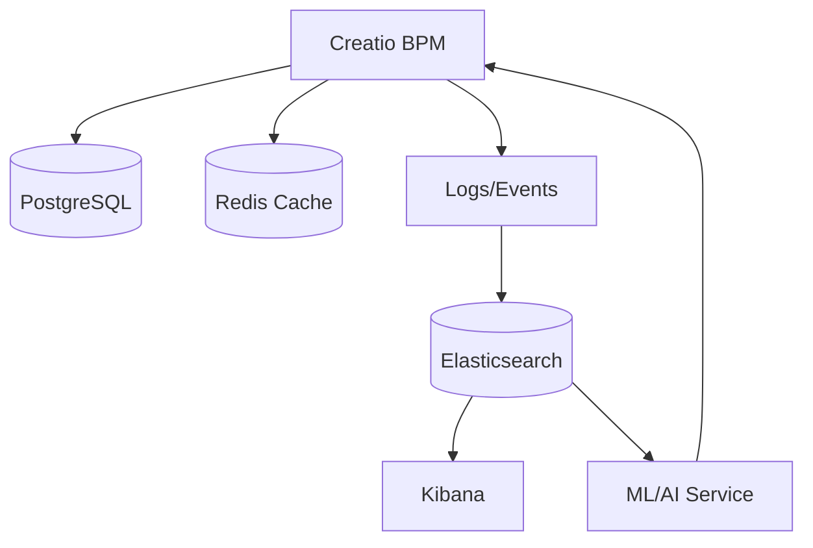

# Creatio BPM 8.2.3 — Deployment Guide

This repository contains an enterprise-ready deployment of **Creatio Sales Enterprise 8.2.3** with optional **NGINX, Keycloak SSO, Elasticsearch, and ML/AI service**.  
Infra: Docker Compose, Redis, PostgreSQL, NGINX; optional: Keycloak, ELK, Prometheus/Grafana, ML API.

## Quick Start

```bash
chmod +x build.sh
./build.sh up


## 📊 Architecture Diagrams

### 1. System Architecture

```mermaid

flowchart TB
    user[User / Browser]
    mobile[Mobile Client]
    api[3rd-party Service]

    subgraph Edge["Ingress & Security"]
      nginx[NGINX Reverse Proxy]
      keycloak[Keycloak SSO / OIDC]
    end

    subgraph App["Application Layer"]
      creatio[Creatio BPM 8.2.3]
      redis[(Redis Cache)]
    end

    subgraph Data["Data Stores & Search"]
      pg[(PostgreSQL)]
      es[(Elasticsearch)]
    end

    subgraph ML["ML/AI Services"]
      mlapi[ML API (Python/FastAPI)]
    end

    user --> nginx
    mobile --> nginx
    api --> nginx
    nginx --> keycloak
    nginx --> creatio
    creatio --> redis
    creatio --> pg
    creatio --> es
    creatio --> mlapi
```

### 2. Authentication Flow (OIDC)



### 3. CI/CD Pipeline



### 4. Analytics & ML Flow


