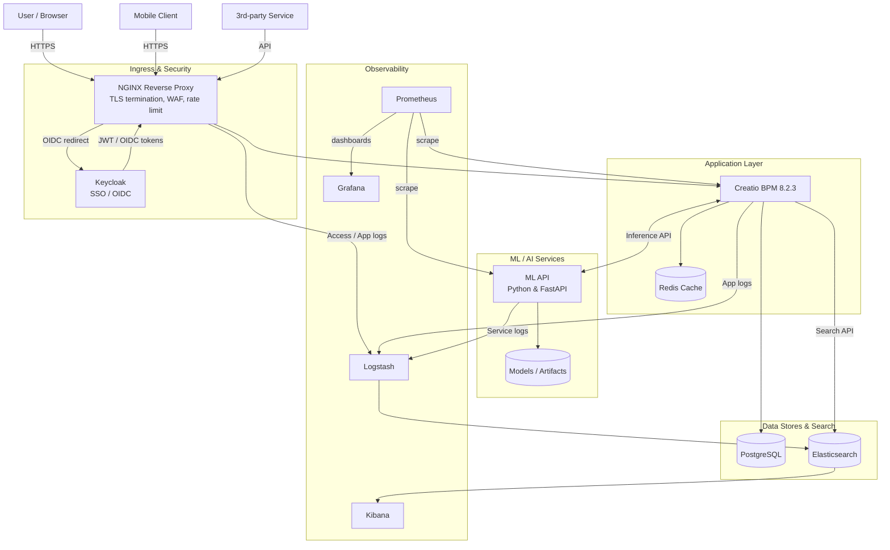
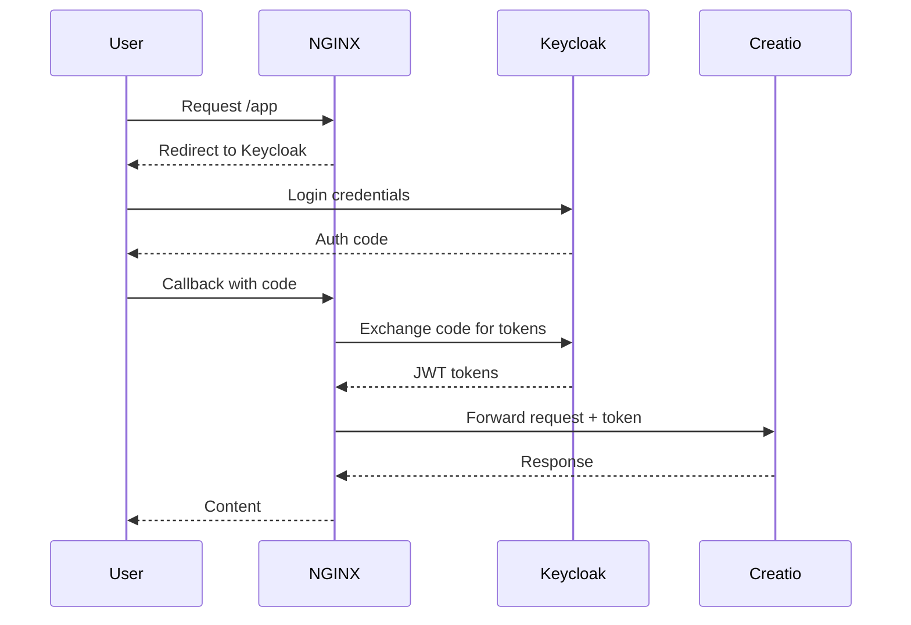
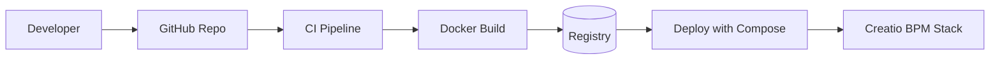
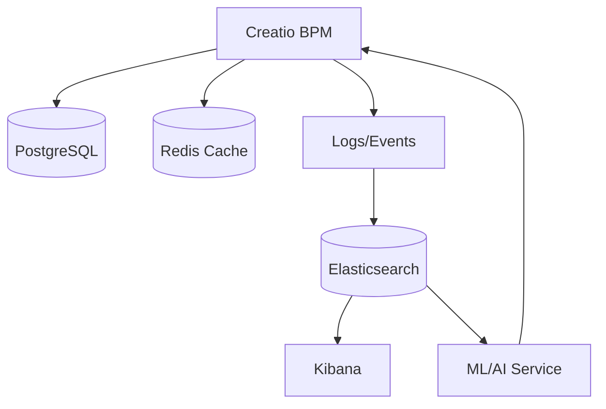

# Creatio BPM 8.2.3 — Deployment Guide

This repository contains an enterprise-ready deployment of **Creatio Sales Enterprise 8.2.3**

## Quick Start

```bash
chmod +x build.sh
./build.sh up
```

## 📊 Architecture Diagrams

### 1. System Architecture



### 2. Authentication Flow (OIDC)



### 3. CI/CD Pipeline



### 4. Analytics & ML Flow


